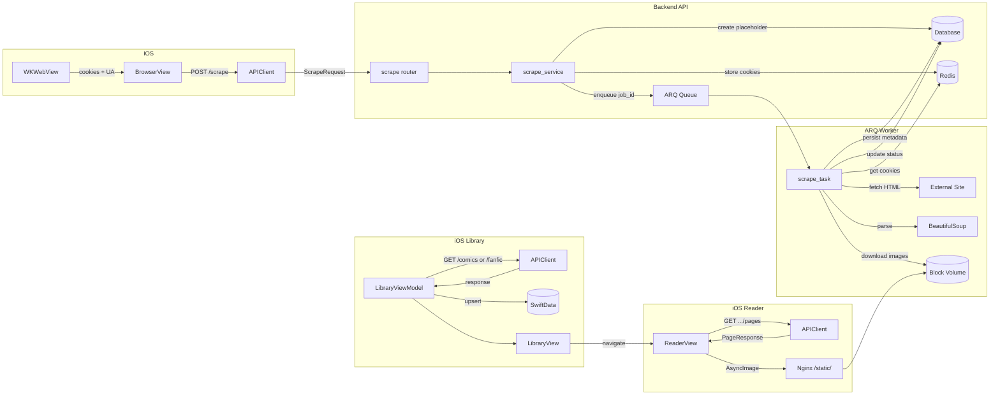
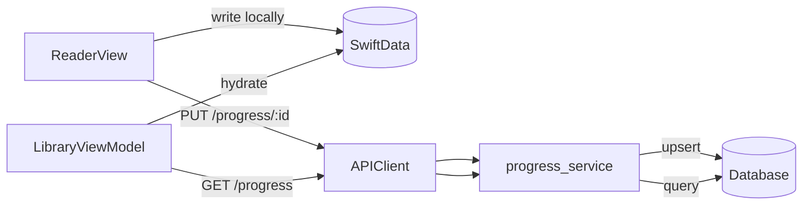

# Data Flow

> End-to-end flow of content from external sources through the backend into the iOS app.

## Scrape-to-Library Flow

## Reading Progress Flow

**Known gap:** ComicReaderView and FanficReaderView write progress to SwiftData locally but the PUT call to the backend is not consistently wired up. See [known-issues/empty-tables.md](../known-issues/empty-tables.md).

## Image Serving Flow

1. Backend scrape task downloads images to block volume at `/mnt/astral-media/comics/{comic_id}/{chapter_id}/page_{n}.jpg`
2. Nginx serves `/static/` mapped to the block volume
3. iOS `ComicPageView` constructs URL: `AppConfig.staticBaseURL + page.filePath`
4. `AsyncImage` loads from that URL

**Critical:** `AppConfig.staticBaseURL` must end with a trailing `/` — without it, URLs become `/staticcomics/...` (404).

## Cookie Lifecycle

1. User opens BrowserView → WKWebView loads source site
2. On every `webView(_:didFinish:)`, cookies are extracted via `WKWebView.configuration.websiteDataStore`
3. `CookieStore.filterCookies()` maps source key (e.g., "ao3") to domain ("archiveofourown.org")
4. When user taps Scrape, cookies + user-agent are sent in `ScrapeRequest`
5. Backend stores cookies in Redis with TTL (`COOKIE_CACHE_TTL_SECS=86400`)
6. Scraper's `_fetch()` reads cookies from Redis, attaches to curl_cffi requests
7. If cookies expire mid-scrape, `CookieExpiredError` → HTTP 428 → iOS shows "Browser refresh needed"
