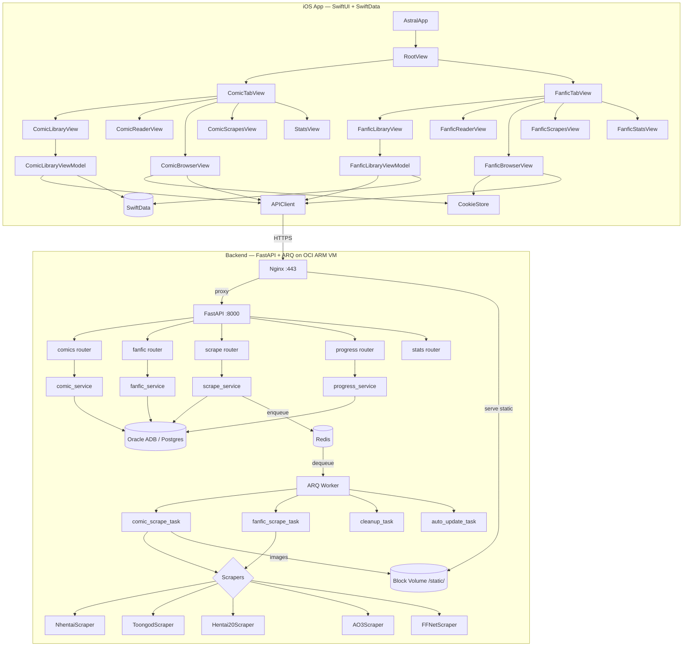

# Architecture Overview

> Astral is a private, single-user iOS reading app for manga/manhwa comics and fan fiction. Backend runs on OCI Free Tier.

## System Diagram

## Tech Stack

| Component | Stack |
|-----------|-------|
| iOS App | SwiftUI, iOS 17.2+, SwiftData, URLSession (async/await) |
| Backend API | Python 3.11+, FastAPI, Uvicorn, Nginx |
| Task Queue | ARQ + Redis |
| Database | Oracle ADB Free Tier (prod) / PostgreSQL (local) |
| DB Driver | python-oracledb thin mode (pure Python, ARM64 native) |
| File Storage | OCI Block Volume (200GB) served as `/static/` |
| TLS | Let's Encrypt + DuckDNS subdomain |
| Scraping | curl_cffi (TLS impersonation) + Playwright ARM64 fallback |
| iOS Cookies | WKWebView harvests CF cookies → sent to backend with scrape requests |

## Deployment Topology

- **Single OCI Ampere A1 VM** (4 cores, 24GB RAM)
- **Two Docker Compose stacks:**
  - `docker-compose.yml`: FastAPI + Nginx + Certbot
  - `docker-compose.worker.yml`: ARQ worker + Redis
- **Block volume** mounted at `/mnt/astral-media`, served by Nginx at `/static/`
- **iOS app** sideloaded via Xcode (free Apple developer account, 7-day cert)

## Single-User Trust Model

No authentication layer. The backend is accessible only from the personal iPhone and local dev machine. This is intentional for a private sideloaded app.

## Key Architecture Decisions

| Decision | Rationale |
|----------|-----------|
| Cookie-Harvest scraping | iOS WKWebView (real Safari) passes Cloudflare natively. Cookies reused server-side. |
| ARQ over Celery | Scraping is I/O-bound. ARQ is asyncio-native, uses Redis only, lighter than Celery. |
| Block Volume over Object Storage | OCI Object Storage free tier caps at 20GB. Block volume gives 200GB. |
| SwiftData for local state | Native SwiftUI integration. Server DB is always source of truth. |
| Per-chapter scrape_status | Replaced single integer checkpoint. Handles non-linear failures correctly. |
| HTTPS from day one | Free with Let's Encrypt + DuckDNS. No ATS exceptions needed. |
