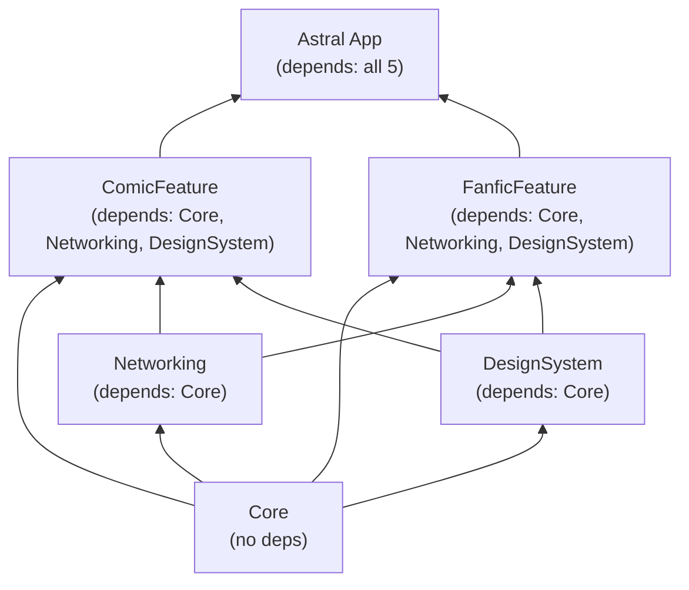
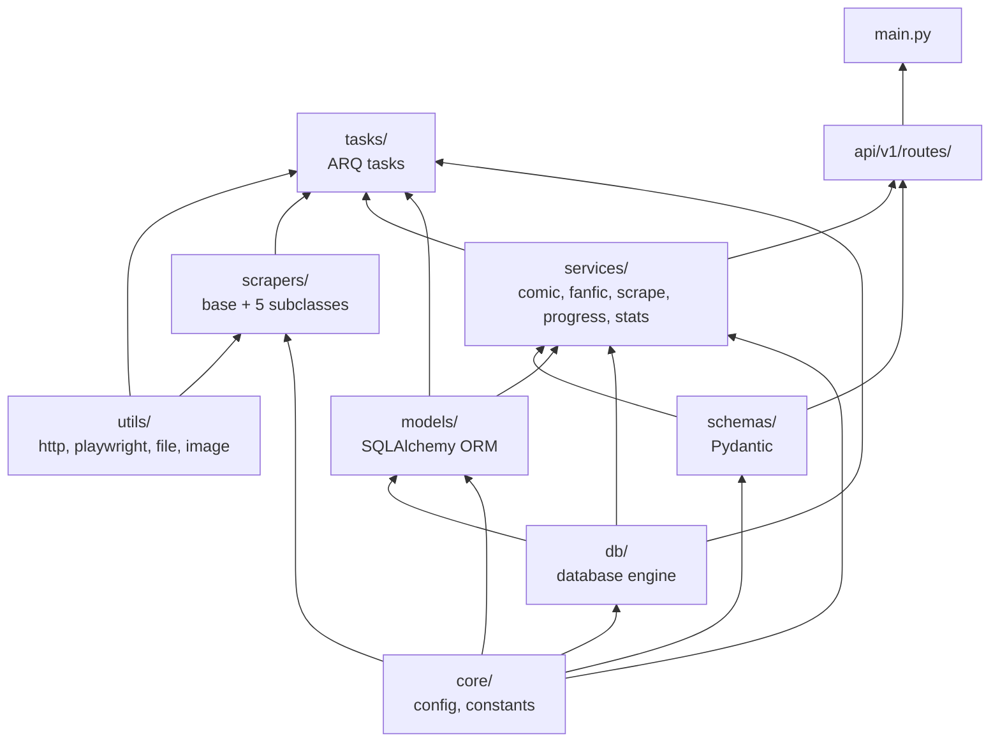

# Package Dependency Graph

> SPM package dependencies for the iOS app and module relationships in the backend.

## iOS SPM Packages

### Package Details

| Package | Path | Dependencies | Exports |
|---------|------|-------------|---------|
| Core | `Packages/Core` | none | SwiftData @Model classes, AppConfig, AstralLogger, ContentType, TimeFilter |
| Networking | `Packages/Networking` | Core | APIClient, Endpoint, CookieStore, all DTOs |
| DesignSystem | `Packages/DesignSystem` | Core | AstralColors, AstralTypography, AstralAnimations, UI components, modifiers |
| ComicFeature | `Packages/ComicFeature` | Core, Networking, DesignSystem | Comic views, viewmodels, ChapterDownloadService |
| FanficFeature | `Packages/FanficFeature` | Core, Networking, DesignSystem | Fanfic views, viewmodels |

All packages target **iOS 17+** and use **Swift 6.0** (swift-tools-version: 6.0).

## Backend Module Dependencies

## XcodeGen Configuration

Project is generated from `ios/Astral/project.yml`:
- Project name: `Astral`
- Bundle ID: `com.astral.reader`
- iOS deployment target: `17.2`
- Swift version: `6.0`
- All 5 packages declared under `packages:` with local paths
- Single target `Astral` depends on all 5 packages
