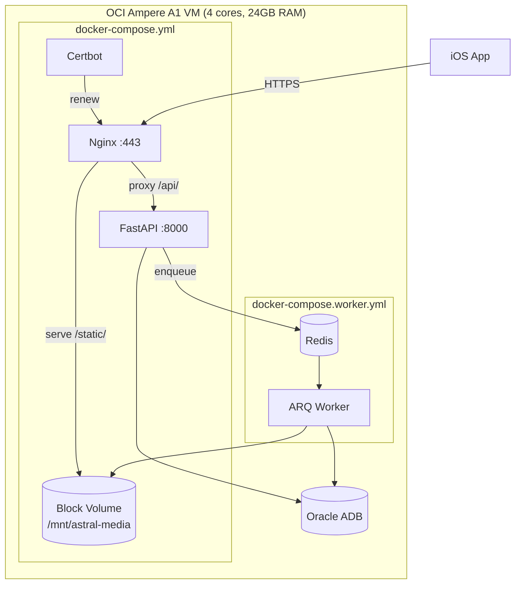

# Backend Infrastructure

> Docker, Nginx, Redis, database, and deployment topology.

## Deployment Diagram

## Docker Compose Stacks

### API Stack (`docker-compose.yml`)

| Service | Image | Ports | Description |
|---------|-------|-------|-------------|
| fastapi | Custom Dockerfile | 8000 | FastAPI + Uvicorn |
| nginx | nginx:alpine | 80, 443 | Reverse proxy + static file serving |
| certbot | certbot/certbot | — | Let's Encrypt cert renewal |

### Worker Stack (`docker-compose.worker.yml`)

| Service | Image | Description |
|---------|-------|-------------|
| redis | redis:alpine | Task queue + cookie cache |
| arq_worker | Custom Dockerfile.worker | ARQ background worker |

Both stacks share the `astral_net` Docker network.

## Nginx Configuration

- SSL termination with Let's Encrypt certs
- `/api/` → proxy_pass to FastAPI :8000
- `/static/` → alias to block volume mount
- Standard security headers

## Database

### Production: Oracle Autonomous Database (Free Tier)
- 1 OCPU, 20GB storage
- mTLS via `ewallet.pem` (thin mode — NOT `cwallet.sso`)
- Driver: `python-oracledb` thin mode, dialect: `oracle+oracledb://`
- PEM file mounted via Docker secrets volume

### Local Development: PostgreSQL
- `docker-compose.local.yml`
- Standard asyncpg driver

### Migrations
- **Tool:** Alembic (`backend/alembic/`)
- **Config:** `backend/alembic.ini`
- Migration scripts in `backend/alembic/versions/`

## Redis

- Cookie cache: `cookies:{source_key}` with TTL (`COOKIE_CACHE_TTL_SECS=86400`)
- ARQ task queue: job IDs, results, scheduling
- No persistence needed — cache-only

## Block Volume

- 200GB OCI Block Volume at `/mnt/astral-media`
- Mounted as `astral_media` Docker volume
- Directory structure: `comics/{comic_id}/{chapter_id}/page_{n}.jpg`
- FastAPI mounts `StaticFiles` at `/static`
- Nginx serves `/static/` directly for performance

## Environment Variables

| Variable | Default | Description |
|----------|---------|-------------|
| DATABASE_URL | — | SQLAlchemy connection string |
| REDIS_URL | redis://redis:6379 | Redis connection |
| BLOCK_VOLUME_PATH | /mnt/astral-media | Static file storage root |
| ARQ_MAX_JOBS | 3 | Max concurrent ARQ tasks |
| SOFT_DELETE_DAYS | 5 | Days before hard-delete |
| COOKIE_CACHE_TTL_SECS | 86400 | Cookie TTL in Redis (24h) |
| SCRAPE_CHAPTER_CONCURRENCY | — | Semaphore limit for parallel chapter scraping |
| SCRAPE_PAGE_CONCURRENCY | — | Semaphore limit for parallel page downloads |

## TLS / Domain

- **Domain:** astral-reader.duckdns.org (free DuckDNS subdomain)
- **Cert:** Let's Encrypt, auto-renewed by Certbot container
- **iOS trust:** Standard LE chain trusted natively — no ATS exceptions
