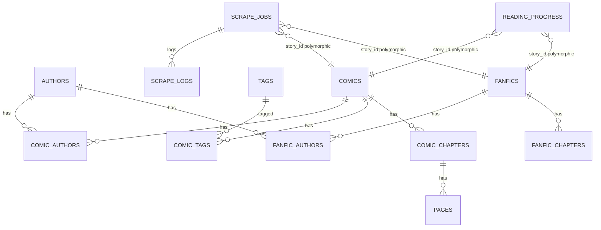

# Backend ORM Models

> SQLAlchemy async ORM models mapping to database tables.

## Entity Relationship Diagram

## Model Files

| Model | File | Table |
|-------|------|-------|
| Comic | `backend/app/models/comic.py` | comics |
| ComicAuthor | `backend/app/models/comic.py` | comic_authors |
| Tag | `backend/app/models/comic.py` | tags |
| ComicTag | `backend/app/models/comic.py` | comic_tags |
| ComicChapter | `backend/app/models/comic.py` | comic_chapters |
| Page | `backend/app/models/comic.py` | pages |
| Fanfic | `backend/app/models/fanfic.py` | fanfics |
| FanficAuthor | `backend/app/models/fanfic.py` | fanfic_authors |
| FanficChapter | `backend/app/models/fanfic.py` | fanfic_chapters |
| Author | `backend/app/models/author.py` | authors |
| ScrapeJob | `backend/app/models/scrape.py` | scrape_jobs |
| ScrapeLog | `backend/app/models/scrape.py` | scrape_logs |
| ReadingProgress | `backend/app/models/progress.py` | reading_progress |
| Base | `backend/app/models/base.py` | (declarative base) |

## Key Models

### Comic
- **PK:** id (UUID)
- **Fields:** title, source_key, source_url, thumbnail_path, total_chapters, status (pending/complete/partial/failed), category, deleted_at (soft delete), created_at, updated_at
- **Relationships:** chapters (one-to-many), comic_authors (join table), comic_tags (join table)

### ComicChapter
- **PK:** id (UUID)
- **FK:** comic_id → comics
- **Fields:** chapter_number (Float — fractional chapters like 10.5), total_pages, scrape_status (pending/scraped/failed), created_at
- **Relationships:** pages (one-to-many), comic (many-to-one)

### Page
- **PK:** id (UUID)
- **FK:** chapter_id → comic_chapters
- **Fields:** page_number, file_path (relative to static mount), width_px, height_px

### Fanfic
- **PK:** id (UUID)
- **Fields:** title, source_key, source_url, summary, fandom, rating, completion_status, word_count, total_chapters, characters, pairing, warnings, published_at, deleted_at, created_at, updated_at
- **Relationships:** chapters (one-to-many), fanfic_authors (join table)

### FanficChapter
- **PK:** id (UUID)
- **FK:** fanfic_id → fanfics
- **Fields:** chapter_number (Float), word_count, content (text — full chapter text), scrape_status, created_at

### Author
- **PK:** id (UUID)
- **Fields:** name (unique), created_at
- **Relationships:** comic_authors, fanfic_authors (shared across content types)

### ScrapeJob
- **PK:** id (UUID)
- **Fields:** content_type (comic/fanfic), story_id (polymorphic FK), status (queued/running/partial/complete/failed), job_type (initial/delta/retry), source_url, source_key, chapters_scraped, chapters_failed, total_chapters, current_step, error_message, last_error_type, created_at, updated_at
- **Relationships:** logs (one-to-many ScrapeLog)

### ScrapeLog
- **PK:** id (UUID)
- **FK:** job_id → scrape_jobs
- **Fields:** timestamp, level (info/warning/error), message, step, error_type

### ReadingProgress
- **PK:** id (UUID)
- **Fields:** content_type, story_id (polymorphic), last_chapter_number, last_page_number, scroll_offset_percent, updated_at

## Polymorphic FK Pattern

ScrapeJob, ReadingProgress use `story_id + content_type` as a discriminated polymorphic FK — no physical FK constraint, resolved in application code by checking content_type to determine whether story_id references comics or fanfics.

## Soft Delete Pattern

Comics and Fanfics have a `deleted_at` column. DELETE endpoints set `deleted_at = now()`. The `cleanup_task` (nightly cron) hard-deletes rows where `deleted_at < now() - SOFT_DELETE_DAYS` (default 5 days). See [concepts/soft-delete-pattern.md](../concepts/soft-delete-pattern.md).
