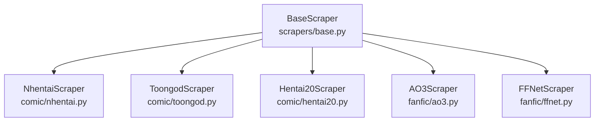

# Backend Scrapers

> Web scrapers that fetch content from external sites. All inherit from BaseScraper.

## Scraper Hierarchy

## BaseScraper Contract

**File:** `backend/app/scrapers/base.py`

### Provided (concrete) Methods

| Method | Description |
|--------|-------------|
| `_fetch(url)` | Rate-limited HTTP GET with cookies from Redis. Uses curl_cffi with TLS impersonation (chrome120). Exponential backoff on 429/503. Respects Retry-After header. |
| `_get_cookies(source_key)` | Reads cookies from Redis cache (`cookies:{source_key}`) |
| `_fetch_via_browser(url)` | Playwright fallback on 2nd consecutive 403. Acquires browser from Semaphore(2) pool. |
| `_refresh_cookies_via_browser()` | Refreshes cookies via headless browser |
| `download_image(url, save_path)` | Downloads image to block volume |

### Abstract Methods (subclasses must implement)

| Method | Returns | Description |
|--------|---------|-------------|
| `get_story_metadata(url)` | StoryMetadata | Title, authors, tags, thumbnail, category, fandom, etc. |
| `get_chapter_list(url)` | [ChapterInfo] | Chapter number + source URL for each chapter |
| `get_chapter_pages(url)` | [PageInfo] | Page number + image URL for each page (comics) |
| `get_chapter_text(url)` | str | Full chapter text (fanfics) |

### Dataclasses

| Name | Key Fields |
|------|------------|
| StoryMetadata | title, source_url, authors, tags, thumbnail_url, category, fandom, rating, word_count |
| ChapterInfo | chapter_number, source_url, title |
| PageInfo | page_number, source_url, width_px, height_px |

### Exceptions

| Name | Description |
|------|-------------|
| CookieExpiredError | Triggers HTTP 428 → iOS shows "Browser refresh needed" |
| ScraperError | Max retries exhausted |

## Scraper Implementations

### NhentaiScraper (`comic/nhentai.py`)
- **Source:** nhentai.net
- **Quirks:** Overrides `_fetch()` to use httpx instead of curl_cffi (curl_cffi blocked by nhentai). Parses `window._gallery` JSON from page source. Single-chapter galleries only.
- **Cloudflare:** Yes — requires cookies from iOS WKWebView.

### ToongodScraper (`comic/toongod.py`)
- **Source:** toongod.org (was .com — domain changed)
- **Quirks:** Multi-chapter webtoons. Handles both `/manga/` and `/webtoon/` URL patterns.
- **Cloudflare:** Yes — requires cookies.
- **Known issues:** Domain mismatch in CookieStore (maps to .com, should be .org). See [known-issues/scraper-bugs.md](../known-issues/scraper-bugs.md).

### Hentai20Scraper (`comic/hentai20.py`)
- **Source:** hentai20.io
- **Quirks:** `requires_browser=True` — always uses Playwright. Different WordPress theme than expected.
- **Known issues:** CSS selectors for authors/tags don't match actual page structure. Returns empty authors[] and tags[]. See [known-issues/empty-tables.md](../known-issues/empty-tables.md).

### AO3Scraper (`fanfic/ao3.py`)
- **Source:** archiveofourown.org
- **Rate limit:** 2s between requests (AO3 enforces strict limits)
- **Quirks:** `get_all_chapters_bulk()` for full-work fetch (downloads entire work in one request). No Cloudflare.
- **Stats extracted:** hits (`dd.hits`), kudos (`dd.kudos`), comments (`dd.comments`), bookmarks (`dd.bookmarks`)
- **Freeform tags:** Extracted from `dd.freeform.tags a`, stored as comma-separated string
- **Selectors:** All verified working ✅ via Playwright testing against multiple works (single-chapter, multi-chapter, 19M+ hits)

### FFNetScraper (`fanfic/ffnet.py`)
- **Source:** fanfiction.net
- **Cloudflare:** Yes — CF protected, requires cookies.
- **Metadata parsing:** Splits the `#profile_top span.xgray` text on ` - ` into segments, extracts structured key:value fields (Words, Reviews, Favs, Follows, Status)
- **Stats mapped:** Reviews → comments_count, Favs → kudos, Follows → bookmarks_count (FFNet has no hits/views)
- **Genre:** Detected by matching segments against known genre word set (Adventure, Romance, Drama, etc.), including compound "Hurt/Comfort"
- **Characters:** Extracted from segments between genre and "Chapters:" that contain name patterns
- **Dates:** From `span[data-xutime]` elements (Updated first, Published second)
- **Fandom:** From breadcrumb links (`#pre_story_links a`), handles both normal and crossover stories
- **Verified:** Playwright-tested against multi-chapter complete, crossover ongoing, and single-genre stories

## Rate Limiting Configuration

Defined in `backend/app/core/constants.py` as `SOURCE_RATE_CONFIG`:

| Source | Delay | Max Retries | Requires Browser |
|--------|-------|-------------|------------------|
| nhentai | configurable | 3 | No |
| toongod | configurable | 3 | No |
| hentai20 | configurable | 3 | Yes |
| ao3 | 2s | 3 | No |
| ffnet | configurable | 3 | No |
