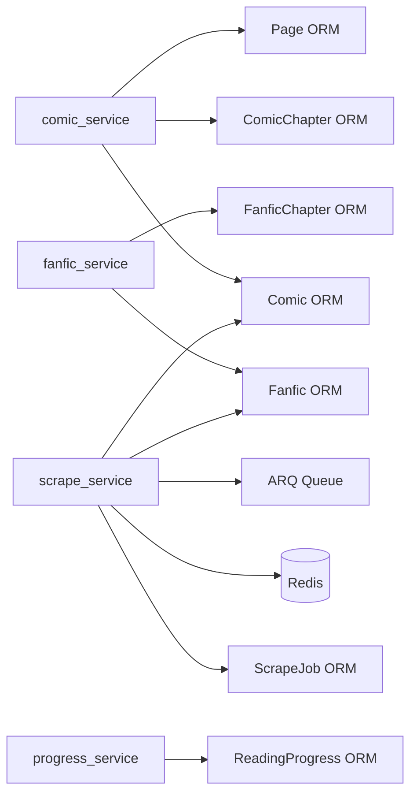

# Backend Services

> Business logic layer. Called by routes, calls ORM models and external systems (Redis, ARQ).

## Service Files

| Service | File | Description |
|---------|------|-------------|
| comic_service | `backend/app/services/comic_service.py` | CRUD for comics, chapters, pages |
| fanfic_service | `backend/app/services/fanfic_service.py` | CRUD for fanfics with server-side filtering |
| scrape_service | `backend/app/services/scrape_service.py` | Scrape job lifecycle: initiate, status, retry, delta |
| progress_service | `backend/app/services/progress_service.py` | Reading progress upsert and query |
| stats_service | `backend/app/services/stats_service.py` | Analytics and aggregate queries |

## Service Details

### comic_service

| Function | Description |
|----------|-------------|
| list_comics(page, page_size, sort) | Paginated query with selectinload(chapters, comic_authors.author, comic_tags.tag). Converts ORM → Pydantic ComicResponse. |
| get_comic(id) | Single comic with full eager loading |
| get_chapter_pages(comic_id, chapter_id) | Returns [PageResponse] for a specific chapter |
| update_comic(id, body) | PATCH: isFavorite, category, skipFirstNPages |
| soft_delete_comic(id) | Sets deleted_at = now(). Cleanup task hard-deletes later. |

### fanfic_service

| Function | Description |
|----------|-------------|
| list_fanfics(page, page_size, fandom, rating, completion_status, sort) | Paginated with server-side WHERE filters. selectinload(chapters, fanfic_authors.author). |
| get_fanfic(id) | Single fanfic with full eager loading |
| get_chapter(fanfic_id, chapter_id) | Returns FanficChapterResponse with content text |
| soft_delete_fanfic(id) | Sets deleted_at = now() |

### scrape_service

| Function | Description |
|----------|-------------|
| initiate_scrape(request) | Creates placeholder Comic/Fanfic row if new. Creates ScrapeJob (status=queued). Stores cookies in Redis (`cookies:{source_key}`, TTL from settings). Enqueues ARQ task. |
| get_job(job_id) | Returns current ScrapeJobResponse |
| list_jobs(page, page_size) | Paginated job list |
| retry_job(job_id) | Creates new job for failed/partial chapters (job_type=retry) |
| delta_update(story_id) | Creates new job to check for new chapters (job_type=delta) |
| get_logs(job_id) | Returns [ScrapeLogEntry] |

### progress_service

| Function | Description |
|----------|-------------|
| upsert(content_type, story_id, body) | Insert or update ReadingProgress row |
| get(content_type, story_id) | Single progress record |
| list_all(content_type) | All progress records for a content type |

## Relationships

