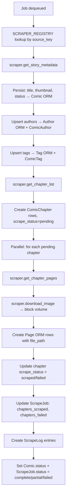

# Backend Tasks (ARQ Worker)

> Background jobs processed by the ARQ worker. Includes scrape tasks and cron jobs.

## Worker Configuration

**File:** `backend/app/worker.py`

- Redis-backed async task queue
- `ARQ_MAX_JOBS=3` — max concurrent jobs
- `job_timeout=3600` (1 hour per job)
- Cron jobs registered alongside task functions

## Task Files

| Task | File | Type | Description |
|------|------|------|-------------|
| comic_scrape_task | `backend/app/tasks/comic_scrape_task.py` | On-demand | Scrapes comic metadata, chapters, and page images |
| fanfic_scrape_task | `backend/app/tasks/fanfic_scrape_task.py` | On-demand | Scrapes fanfic metadata and chapter text |
| cleanup_task | `backend/app/tasks/cleanup_task.py` | Cron (03:00 UTC daily) | Hard-deletes soft-deleted rows past SOFT_DELETE_DAYS |
| auto_update_task | `backend/app/tasks/auto_update_task.py` | Cron (every 6 hours) | Queues delta jobs for ongoing stories |

## comic_scrape_task

The most complex task. Flow:

**Concurrency:** `chapter_sem` and `page_sem` asyncio.Semaphores control parallel chapter/page downloads.

**Per-chapter checkpointing:** Each chapter gets its own `scrape_status` (pending/scraped/failed). Retry queries `WHERE scrape_status IN ('failed', 'pending')`.

## fanfic_scrape_task

Similar to comic_scrape_task but for text:
- Uses `get_chapter_text()` instead of `get_chapter_pages()`
- AO3 supports `get_all_chapters_bulk()` for full-work fetch in one request
- Chapter content stored as text in FanficChapter.content column (not files)

## cleanup_task

- **Schedule:** Nightly at 03:00 UTC
- **Logic:** `DELETE FROM table WHERE deleted_at < now() - interval SOFT_DELETE_DAYS`
- **Default:** `SOFT_DELETE_DAYS=5`
- **Tables affected:** comics, fanfics (and cascading to chapters, pages, join tables)

## auto_update_task

- **Schedule:** Every 6 hours
- **Logic:** Queries ongoing stories (completion_status != complete for fanfics, series comics for toongod/hentai20). Creates delta scrape jobs for each.
- **Job type:** `delta` — only scrapes chapters not already present

## Relationships

| From | To | Type |
|------|----|------|
| scrape_service.initiate_scrape() | ARQ queue | enqueues comic/fanfic_scrape_task |
| scrape_service.retry_job() | ARQ queue | enqueues with job_type=retry |
| auto_update_task | ARQ queue | enqueues delta jobs |
| comic_scrape_task | SCRAPER_REGISTRY | lookup by source_key |
| comic_scrape_task | Comic, ComicChapter, Page, Author, Tag ORM | writes |
| comic_scrape_task | ScrapeJob, ScrapeLog ORM | updates |
| comic_scrape_task | Redis | reads cookies |
| comic_scrape_task | Block Volume | writes images |
