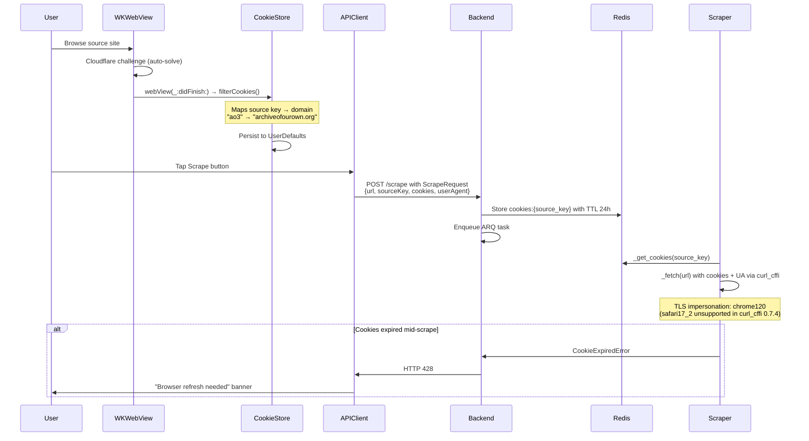

# Cookie Harvest Flow

> How iOS WKWebView cookies are extracted and reused by backend scrapers to bypass Cloudflare.

## Why

Manga/fanfic sites use Cloudflare (or similar) protection. Datacenter IPs are blocked immediately. iOS WKWebView is real Safari — it passes Cloudflare challenges natively. The harvested `cf_clearance` cookie + user-agent lets the backend impersonate that Safari session.

## Flow



## Key Components

| Component | File | Role |
|-----------|------|------|
| CookieStore | `Packages/Networking/.../CookieStore.swift` | iOS-side: extracts and persists cookies per source domain |
| ScrapeRequest | `Packages/Networking/.../DTOs/ScrapeDTOs.swift` | DTO carrying cookies + userAgent to backend |
| scrape_service | `backend/app/services/scrape_service.py` | Stores cookies in Redis |
| BaseScraper._fetch() | `backend/app/scrapers/base.py` | Reads cookies from Redis, attaches to requests |
| BaseScraper._fetch_via_browser() | `backend/app/scrapers/base.py` | Playwright fallback on repeated 403 |

## Cookie Extraction Trigger

Cookies are extracted on **every** `webView(_:didFinish:)` navigation — not only when the user taps Scrape. This ensures fresh cookies are always available.

## CookieStore Domain Mapping

```swift
// CookieStore.sourceDomains
"nhentai"  → "nhentai.net"
"toongod"  → "toongod.com"   // BUG: should be .org
"hentai20" → "hentai20.io"
"ao3"      → "archiveofourown.org"
"ffnet"    → "fanfiction.net"
```

## TTL

`COOKIE_CACHE_TTL_SECS=86400` (24 hours). After TTL expiry, the next scrape attempt will fail with CookieExpiredError, prompting the user to re-browse and refresh cookies.
