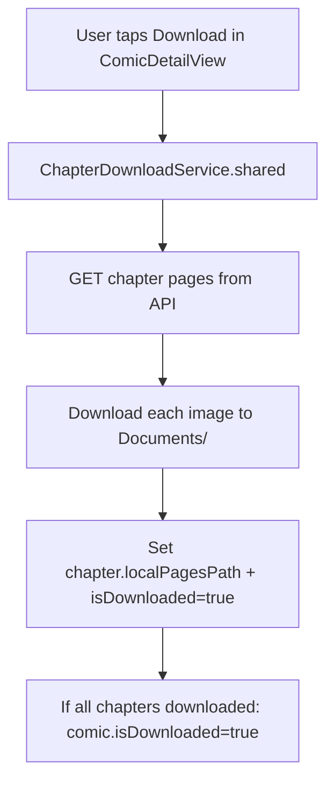
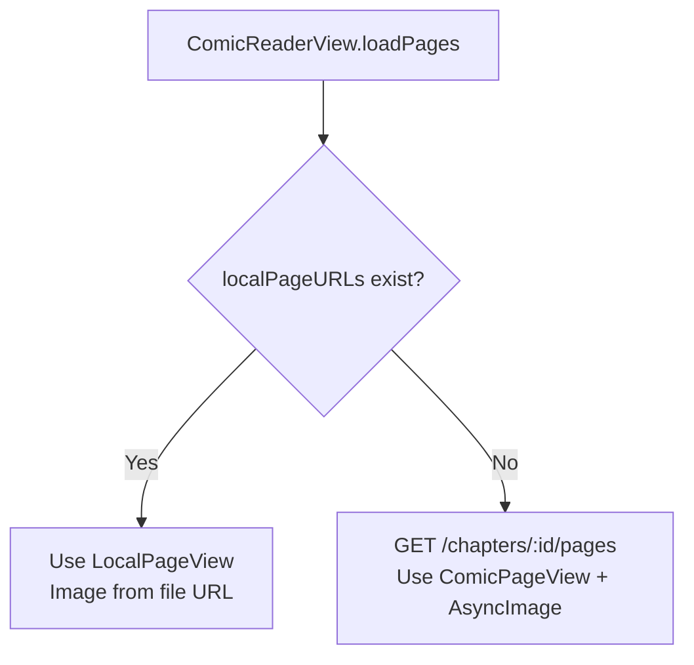

# Offline Mode

> How comics can be downloaded for offline reading.

## Overview

ChapterDownloadService downloads comic page images to the device's Documents directory. When opening a chapter, the reader checks for local files before making an API call.

## Components

| Component | File | Role |
|-----------|------|------|
| ChapterDownloadService | `Packages/ComicFeature/.../Services/ChapterDownloadService.swift` | Downloads images, manages local storage |
| ComicReaderView | `Packages/ComicFeature/.../Reader/ComicReaderView.swift` | Checks local pages before API call |
| LocalComicChapter | `Packages/Core/.../Models/LocalComicChapter.swift` | isDownloaded flag, localPagesPath |
| LocalPageView | `Packages/ComicFeature/.../Reader/ComicReaderView.swift` | Renders from local file URL |

## Download Flow

## Reader Flow (local-first)

In `ComicReaderView.loadPages()`:
1. First checks `ChapterDownloadService.shared.localPageURLs(for: chapter)`
2. If local URLs exist and are non-empty → uses them (no network)
3. Otherwise → API call for PageResponse[] → AsyncImage loads from static server

## Storage

- **Location:** App Documents directory
- **Limit:** `AppConfig.downloadLimitPerTabBytes`
- **Cleanup:** Manual (user deletes from ComicDetailView)

## Fanfic Offline

Fanfic chapters store text in `LocalFanficChapter.localTextPath` when downloaded. Similar pattern but for text instead of images.
