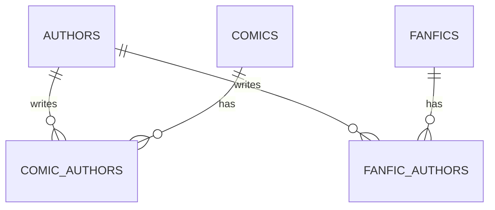

# Entity: Author

> Traces the Author entity across the stack. Authors are shared between comics and fanfics.

## Layer Map

| Layer | Type | File |
|-------|------|------|
| Backend ORM | Author | `backend/app/models/author.py` |
| Backend ORM | ComicAuthor (join) | `backend/app/models/comic.py` |
| Backend ORM | FanficAuthor (join) | `backend/app/models/fanfic.py` |
| Backend Schema | AuthorResponse | `backend/app/schemas/shared.py` |
| iOS DTO | AuthorResponse | `Packages/Networking/.../DTOs/SharedDTOs.swift` |
| iOS Model | LocalAuthor | `Packages/Core/.../Models/LocalAuthor.swift` |

## Relationships

## Key Observations

- **Shared across content types**: One Author row can be linked to both comics and fanfics via separate join tables.
- **Upserted by scrape tasks**: `get-or-create by name` pattern in comic_scrape_task and fanfic_scrape_task.
- **iOS stores authors as JSON**: LocalComic.authorsJSON is a JSON string, not a @Relationship to LocalAuthor. LocalAuthor exists but is used separately.
- **Known gap**: comic_authors table is empty because Hentai20Scraper (the only comic source with 18 comics) returns empty authors due to CSS selector mismatch.
