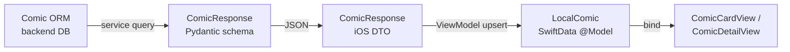

# Entity: Comic

> Traces the Comic entity across every layer of the stack.

## Layer Map

| Layer | Type | File |
|-------|------|------|
| Backend ORM | Comic (SQLAlchemy) | `backend/app/models/comic.py` |
| Backend Schema | ComicResponse (Pydantic) | `backend/app/schemas/comic.py` |
| iOS DTO | ComicResponse (Codable) | `Packages/Networking/.../DTOs/ComicDTOs.swift` |
| iOS Model | LocalComic (@Model) | `Packages/Core/.../Models/LocalComic.swift` |
| iOS Views | ComicCardView, ComicDetailView, ComicReaderView | `Packages/ComicFeature/.../Library/`, `Reader/` |
| iOS ViewModel | ComicLibraryViewModel | `Packages/ComicFeature/.../ViewModels/ComicLibraryViewModel.swift` |

## Data Flow

## Field Mapping

| Concept | Backend ORM | Backend Schema | iOS DTO | iOS @Model |
|---------|------------|---------------|---------|------------|
| Identity | id (UUID PK) | id | id | id (UUID, @Attribute(.unique)) |
| Title | title (String) | title | title | title |
| Source | source_key (String) | sourceKey | sourceKey | sourceKey |
| Source URL | source_url (String) | sourceUrl | sourceUrl | — |
| Thumbnail | thumbnail_path (String) | thumbnailPath | thumbnailPath | thumbnailPath |
| Total chapters | total_chapters (Int) | totalChapters | totalChapters | totalChapters |
| Status | status (String) | status | status | status |
| Category | category (String, nullable) | category | category | category |
| Favorite | — | — | — | isFavorite (local-only) |
| Tags | comic_tags → tags (join) | tags: [TagResponse] | tags | tagsJSON (String) |
| Authors | comic_authors → authors (join) | authors: [AuthorResponse] | authors | authorsJSON (String) |
| Skip pages | — | — | — | skipFirstNPages (local-only) |
| Last read chapter | — (in ReadingProgress) | — | — | lastReadChapterNumber |
| Last read page | — (in ReadingProgress) | — | — | lastReadPageNumber |
| Progress % | — | — | — | progressPercent |
| Last read at | — | — | — | lastReadAt |
| Completed at | — | — | — | completedAt |
| Soft delete | deleted_at | — | — | — |
| Chapters | relationship → [ComicChapter] | chapters: [ComicChapterResponse] | chapters | @Relationship → [LocalComicChapter] |

## Key Observations

- **Tags/Authors stored as JSON strings on iOS** (tagsJSON, authorsJSON) rather than separate SwiftData models — avoids complex @Relationship graphs for display-only data.
- **Reading progress fields live on LocalComic** (local), not synced back to backend's ReadingProgress table (known gap).
- **isFavorite, skipFirstNPages** are iOS-local fields. isFavorite can be synced via PATCH `/comics/{id}`.
- **Soft delete** only exists on the backend side. iOS just removes from SwiftData on delete.

## Sources

Comics come from 3 scrapers: NhentaiScraper, ToongodScraper, Hentai20Scraper. Source is identified by `source_key` (nhentai, toongod, hentai20).
