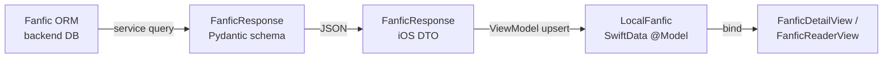

# Entity: Fanfic

> Traces the Fanfic entity across every layer of the stack.

## Layer Map

| Layer | Type | File |
|-------|------|------|
| Backend ORM | Fanfic (SQLAlchemy) | `backend/app/models/fanfic.py` |
| Backend Schema | FanficResponse (Pydantic) | `backend/app/schemas/fanfic.py` |
| iOS DTO | FanficResponse (Codable) | `Packages/Networking/.../DTOs/FanficDTOs.swift` |
| iOS Model | LocalFanfic (@Model) | `Packages/Core/.../Models/LocalFanfic.swift` |
| iOS Views | FanficDetailView, FanficReaderView | `Packages/FanficFeature/.../Library/`, `Reader/` |
| iOS ViewModel | FanficLibraryViewModel | `Packages/FanficFeature/.../ViewModels/FanficLibraryViewModel.swift` |

## Data Flow

## Field Mapping

| Concept | Backend ORM | iOS DTO | iOS @Model |
|---------|------------|---------|------------|
| Identity | id (UUID PK) | id | id |
| Title | title | title | title |
| Source | source_key | sourceKey | sourceKey |
| Summary | summary | summary | summary |
| Fandom | fandom | fandom | fandom |
| Rating | rating | rating | rating |
| Status | completion_status | completionStatus | completionStatus |
| Word count | word_count | wordCount | wordCount |
| Total chapters | total_chapters | totalChapters | totalChapters |
| Characters | characters | characters | characters |
| Pairing | pairing | pairing | pairing |
| Warnings | warnings | warnings | warnings |
| Published | published_at | publishedAt | publishedAt |
| Authors | fanfic_authors → authors | authors | — (stored on detail view) |
| Chapters | relationship → [FanficChapter] | chapters | @Relationship → [LocalFanficChapter] |
| Favorite | — | — | isFavorite (local-only) |

## Engagement Stats

| Stat | AO3 Source | FFNet Source | Backend Column | iOS Field |
|------|-----------|-------------|---------------|-----------|
| Views | dd.hits | (not exposed) | hits | hits |
| Likes | dd.kudos | Favs | kudos | kudos |
| Comments | dd.comments | Reviews | comments_count | commentsCount |
| Saves | dd.bookmarks | Follows | bookmarks_count | bookmarksCount |
| Tags | dd.freeform.tags a | genre from metadata | freeform_tags | freeformTags |

## Key Observations

- Fanfics have richer metadata than comics (fandom, rating, characters, pairing, warnings, word count, engagement stats).
- **Server-side filtering** supported: fandom, rating, completion_status, sort — passed as query params from FanficFilterView.
- Chapter content (full text) stored in `FanficChapter.content` column in the database, not as files.
- **Authors** stored as `authorsText` (comma-separated string) on LocalFanfic, displayed in both library row and detail view.
- **Rescrape:** FanficDetailView has a toolbar button that calls `deltaUpdate(storyId:)` to refresh metadata + pick up new chapters.
- Sources: AO3Scraper (full stats), FFNetScraper (Reviews/Favs/Follows mapped to comments/kudos/bookmarks).
