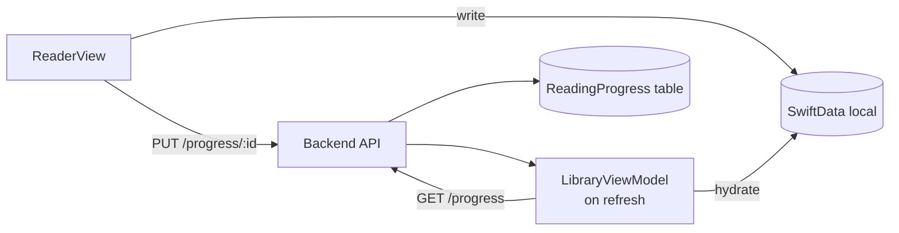

# Entity: Reading Progress

> Tracks where the user left off in a comic or fanfic. Exists on both backend and iOS.

## Layer Map

| Layer | Type | File |
|-------|------|------|
| Backend ORM | ReadingProgress | `backend/app/models/progress.py` |
| Backend Schema | ProgressResponse | `backend/app/schemas/progress.py` |
| iOS DTO | ComicProgressRequest | `Packages/Networking/.../DTOs/ProgressDTOs.swift` |
| iOS DTO | FanficProgressRequest | `Packages/Networking/.../DTOs/ProgressDTOs.swift` |
| iOS DTO | ProgressResponse | `Packages/Networking/.../DTOs/ProgressDTOs.swift` |
| iOS Model | LocalComic fields | `Packages/Core/.../Models/LocalComic.swift` |
| iOS Model | LocalFanfic fields | `Packages/Core/.../Models/LocalFanfic.swift` |

## How Progress is Stored

### Backend (ReadingProgress table)
- content_type + story_id (polymorphic)
- last_chapter_number
- last_page_number (comics)
- scroll_offset_percent (fanfics)
- updated_at

### iOS (denormalized on @Model)
- LocalComic: lastReadChapterNumber, lastReadPageNumber, progressPercent, lastReadAt, completedAt
- LocalFanfic: (similar fields)

## Known Gap: Progress Not Synced to Backend

**Status:** The `reading_progress` backend table is empty.

**Root cause:** ComicReaderView and FanficReaderView write progress to local SwiftData only. The PUT endpoints exist and work, the iOS Endpoint definitions exist, but they are never called from the reader views.

**What works:**
- `GET /progress` (allProgress) IS called by LibraryViewModels on refresh to hydrate from server
- Local SwiftData writes happen on every chapter open

**What's missing:**
- ComicReaderView.loadPages() should call `APIClient.shared.request(.updateComicProgress(...))` after SwiftData save
- FanficReaderView should call `APIClient.shared.request(.updateFanficProgress(...))` after SwiftData save
- Should respect the 5s debounce rule from CLAUDE.md

See [known-issues/empty-tables.md](../known-issues/empty-tables.md) for full details.

## Progress Flow (intended)

