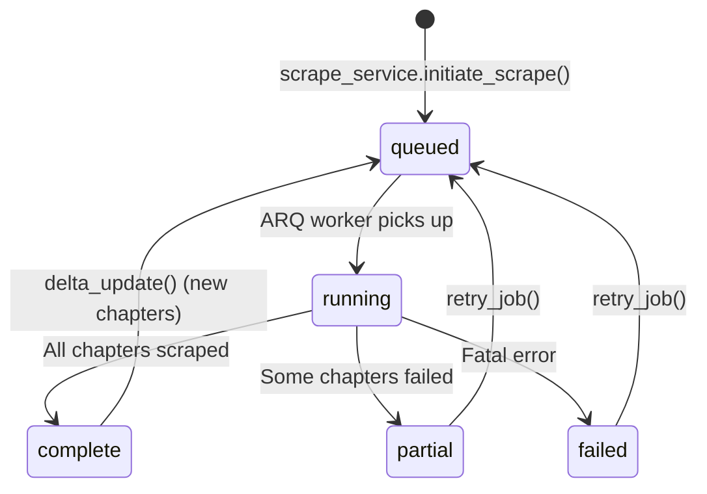

# Entity: Scrape Job

> Traces the ScrapeJob lifecycle from initiation to completion across all layers.

## Layer Map

| Layer | Type | File |
|-------|------|------|
| Backend ORM | ScrapeJob | `backend/app/models/scrape.py` |
| Backend ORM | ScrapeLog | `backend/app/models/scrape.py` |
| Backend Schema | ScrapeJobResponse | `backend/app/schemas/scrape.py` |
| Backend Schema | ScrapeLogEntry | `backend/app/schemas/scrape.py` |
| iOS DTO | ScrapeJobResponse | `Packages/Networking/.../DTOs/ScrapeDTOs.swift` |
| iOS DTO | ScrapeLogEntry | `Packages/Networking/.../DTOs/ScrapeDTOs.swift` |
| iOS DTO | ScrapeRequest | `Packages/Networking/.../DTOs/ScrapeDTOs.swift` |
| iOS Model | LocalScrapeJob | `Packages/Core/.../Models/LocalScrapeJob.swift` |
| iOS View | ComicScrapesView | `Packages/ComicFeature/.../Scrapes/ComicScrapesView.swift` |
| iOS View | FanficScrapesView | `Packages/FanficFeature/.../Scrapes/FanficScrapesView.swift` |

## Lifecycle

## Job Types

| Type | Trigger | Behavior |
|------|---------|----------|
| initial | User taps Scrape in BrowserView | Scrapes all chapters from scratch |
| delta | auto_update_task or manual delta_update() | Only scrapes chapters not already present |
| retry | User taps Retry in ScrapesView | Re-scrapes failed/pending chapters only |

## Status Fields

| Field | Description |
|-------|-------------|
| status | queued / running / partial / complete / failed |
| chapters_scraped | Count of successfully scraped chapters |
| chapters_failed | Count of failed chapters |
| total_chapters | Total chapter count from metadata |
| current_step | Human-readable progress string |
| error_message | Last error detail |
| last_error_type | Error classification |

## iOS Scrape Flow

1. User opens BrowserView → navigates to source site
2. WKWebView extracts cookies on every page load
3. User taps Scrape → `ScrapeRequest` sent with url, sourceKey, cookies, userAgent
4. Backend creates job → returns `ScrapeJobResponse`
5. iOS polls `scrapeStatus(jobId:)` or navigates to ScrapesView
6. ScrapesView shows job list with status, progress, retry option
7. Job detail sheet shows ScrapeLog entries
