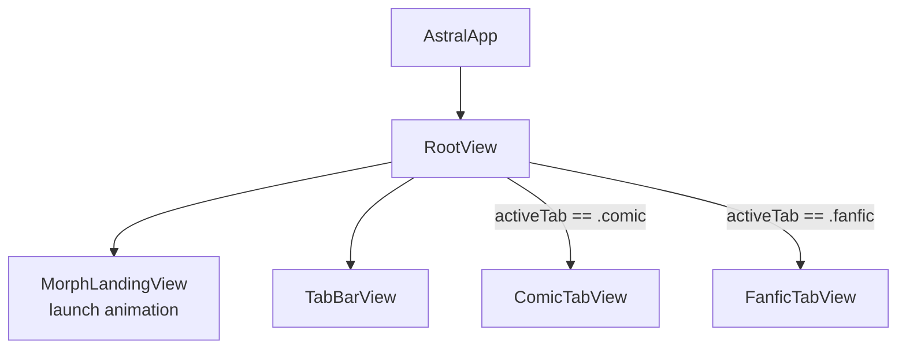

# iOS App Layer

> The thin app shell: entry point, root navigation, tab switching, and landing animation.

## Entities

| Name | Type | File | Description |
|------|------|------|-------------|
| AstralApp | @main App | `ios/Astral/AstralApp.swift` | Entry point. Sets up SwiftData ModelContainer with all @Model types. |
| RootView | View | `ios/Astral/App/RootView.swift` | Root ZStack. Shows MorphLandingView on launch, then switches to ComicTabView or FanficTabView based on AppState.activeTab. |
| MorphLandingView | View | `ios/Astral/App/RootView.swift` | Animated landing screen with gold/blue orbs and 4-phase spring animation. Plays on first launch. |
| AppState | @Observable | `ios/Astral/App/AppState.swift` | Holds activeTab (AppTab enum), sidebar open/closed state. Shared across tab views. |
| AppTab | Enum | `ios/Astral/App/AppState.swift` | `.comic`, `.fanfic` |
| TabBarView | View | `ios/Astral/App/TabBarView.swift` | Custom bottom tab bar (not SwiftUI TabView). Gold highlight for active tab. |

## Relationships

| From | To | Type | Description |
|------|-----|------|-------------|
| AstralApp | RootView | creates | WindowGroup content |
| AstralApp | ModelContainer | configures | Registers all @Model types from Core package |
| RootView | AppState | owns | @State private var |
| RootView | ComicTabView | presents | When activeTab == .comic |
| RootView | FanficTabView | presents | When activeTab == .fanfic |
| RootView | MorphLandingView | presents | On first launch (animation overlay) |
| RootView | TabBarView | contains | Bottom bar for tab switching |
| TabBarView | AppState | reads/writes | Toggles activeTab |

## Navigation Diagram

