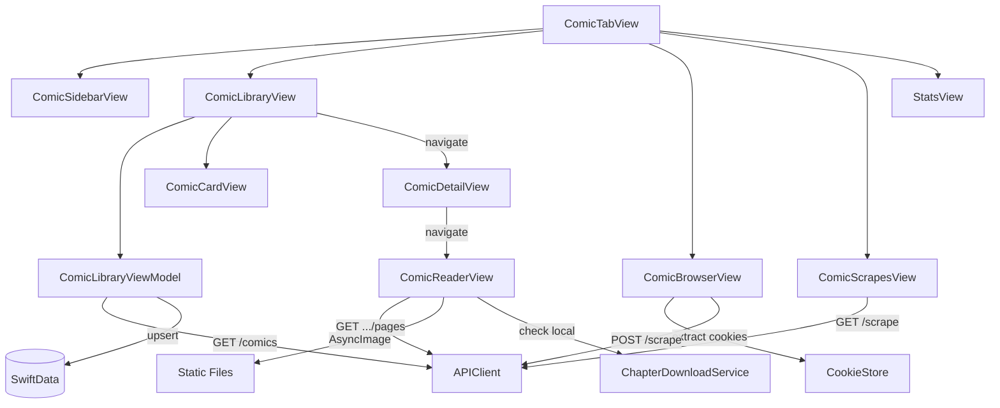

# ComicFeature Package

> All comic-related views, view models, and services. Depends on Core, Networking, DesignSystem.

## Entities

### Views

| Name | File | Description |
|------|------|-------------|
| ComicTabView | `ComicTabView.swift` | Root comic tab: sidebar drawer + main content area |
| ComicSidebarView | `ComicSidebarView.swift` | Slide-over sidebar: Recents, Library, Read, Browse, Scrapes, Stats |
| ComicLibraryView | `Library/ComicLibraryView.swift` | LazyVGrid 2-column card grid. Pulls comics from ViewModel. Shows BackendStatusBanner on error. EmptyStateView when empty. |
| ComicCardView | `Library/ComicCardView.swift` | Card cell: thumbnail + title + progress bar + favorite heart |
| ComicDetailView | `Library/ComicDetailView.swift` | Story detail: metadata, chapter list, download, delete. Navigates to ComicReaderView on chapter tap. |
| ComicSearchView | `Library/ComicSearchView.swift` | Search comics by title and metadata |
| ComicReaderView | `Reader/ComicReaderView.swift` | Full-screen image reader. Supports webtoon (vertical scroll) and paged (horizontal swipe) modes. HUD overlay with chapter nav, slider, settings. Long press for page actions. |
| ComicBrowserView | `Browser/ComicBrowserView.swift` | WKWebView with source picker (nhentai/toongod/hentai20). Cookie extraction on every navigation finish. Scrape button. ContentBlocker for ads. |
| ComicScrapesView | `Scrapes/ComicScrapesView.swift` | Scrape job list: in-progress, partial, completed, failed. Retry button. Job detail sheet with logs. |
| StatsView | `Stats/StatsView.swift` | Comic statistics dashboard: reading activity, source distribution, backlog tiers |

### ViewModels

| Name | File | Description |
|------|------|-------------|
| ComicLibraryViewModel | `ViewModels/ComicLibraryViewModel.swift` | @Observable. fetchComics() → API → upsert LocalComic + LocalComicChapter into SwiftData. Fetches allProgress on refresh. Handles APIError (cookieRefreshNeeded, URLError). |

### Services

| Name | File | Description |
|------|------|-------------|
| ChapterDownloadService | `Services/ChapterDownloadService.swift` | Downloads chapter page images to Documents directory for offline reading. Checks local pages before API in reader. |

## Relationships

## Reader Details

ComicReaderView supports two modes:
- **Webtoon** (vertical): `ScrollView(.vertical)` + `LazyVStack` — continuous vertical strip
- **Paged** (horizontal): `ScrollView(.horizontal)` + `LazyHStack` + `scrollTargetBehavior(.paging)` + `scrollPosition(id:)`

HUD toggled via `simultaneousGesture(LongPressGesture(minimumDuration: 0.5))` — uses simultaneousGesture to avoid blocking scroll.

Tap zones divide the screen into thirds: left (prev page), center (toggle HUD), right (next page).

Page actions on long press: save image, share.

Reading progress written to SwiftData on every chapter open. Backend progress sync via PUT endpoint (partially wired).
