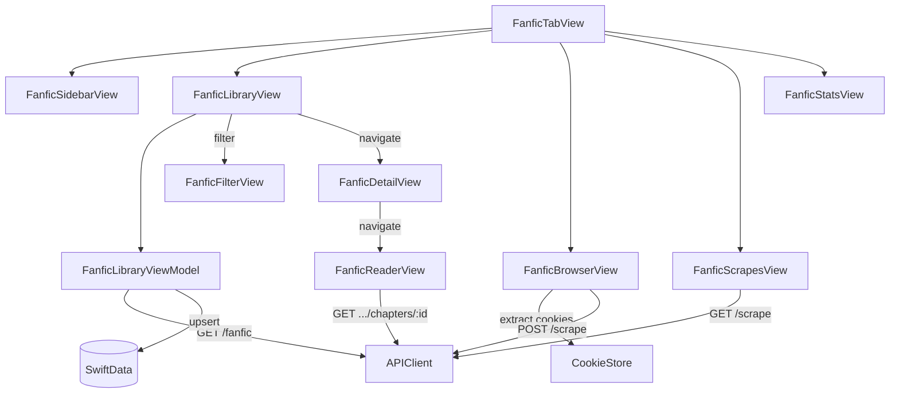

# FanficFeature Package

> All fanfic-related views, view models, and services. Depends on Core, Networking, DesignSystem.

## Entities

### Views

| Name | File | Description |
|------|------|-------------|
| FanficTabView | `FanficTabView.swift` | Root fanfic tab: sidebar drawer + main content area |
| FanficSidebarView | `FanficSidebarView.swift` | Slide-over sidebar: Recent Stories, Library, Search, Downloads, Browse, Scrapes |
| FanficLibraryView | `Library/FanficLibraryView.swift` | Full-width list with filter. Pulls fanfics from ViewModel. |
| FanficDetailView | `Library/FanficDetailView.swift` | Fanfic detail: summary, metadata (fandom, rating, word count, characters), chapter list. Navigates to reader. |
| FanficFilterView | `Library/FanficFilterView.swift` | Bottom sheet filter: fandom, rating, completion status, word count range, language |
| FanficReaderView | `Reader/FanficReaderView.swift` | Text reader with chapter picker. Customizable font size, line height, background color. Scroll position tracking for progress. |
| FanficBrowserView | `Browser/FanficBrowserView.swift` | WKWebView with source picker (AO3 / FFNet). Cookie extraction on every navigation finish. Scrape button. |
| FanficScrapesView | `Scrapes/FanficScrapesView.swift` | Scrape job list for fanfic scrapes. Same pattern as ComicScrapesView. |
| FanficStatsView | `Stats/FanficStatsView.swift` | Fanfic statistics dashboard |

### ViewModels

| Name | File | Description |
|------|------|-------------|
| FanficLibraryViewModel | `ViewModels/FanficLibraryViewModel.swift` | @Observable. fetchFanfics() with filter params → API → upsert LocalFanfic + LocalFanficChapter into SwiftData. Fetches allProgress on refresh. |

## Relationships

## Reader Details

FanficReaderView renders chapter text as styled HTML/attributed string. Customization:
- Font size (adjustable)
- Line height (adjustable)
- Background color (dark/sepia/light)

Scroll position tracked for reading progress. Progress written to local SwiftData.

## Filter System

FanficFilterView exposes server-side filters passed as query parameters:
- `fandom` — freeform text (from AO3/FFNet metadata)
- `rating` — dropdown (G, T, M, E for AO3; K, K+, T, M for FFNet)
- `completion_status` — In Progress / Complete
- `sort` — title, word_count, updated_at, etc.
